# 云南十天（昆明大理泸沽湖丽江香格里拉）(4) 提取稿

- 段落数：376
- 图片引用数：48

## 正文与图片引用

Day1（3.30）：昆明老街—云南大学、翠湖公园、陆军讲武堂—滇池（海埂公园，海埂大坝）—昆明老街（宿）

早餐推荐：元吉老一碗小锅米线，前一晚也可住昆明老街附近。

10:00—12:00昆明老街—云南大学（公交或打车）

交通：直接打车前往“云南大学东陆校区”，滴滴打车约10元。

预约方式：

关注“平安云大”公众号，选择东陆预约，选择“翠湖云大”。

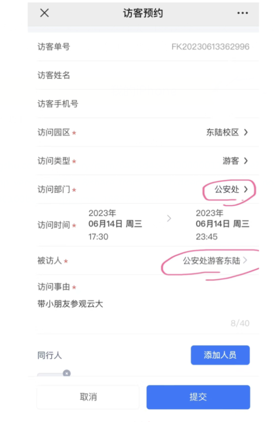
> 引用：Image 001 · image1.png · 段落 7

> 段落 7 仅包含图片

云南大学校园内中外建筑汇集，繁花似锦诗意流淌。会泽楼是其标志性建筑，钟楼和食堂亦是不能错过的打卡点。

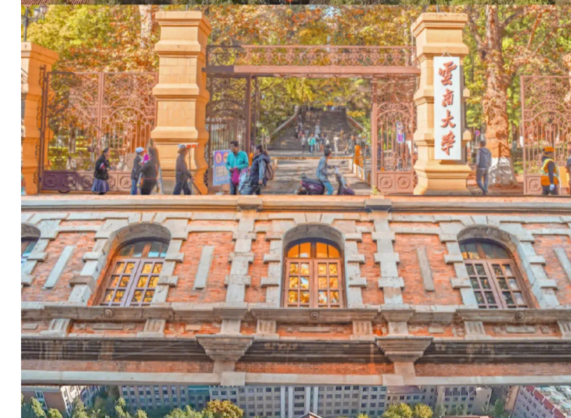
> 引用：Image 002 · image2.png · 段落 9

> 段落 9 仅包含图片

龙门道
正门进去就是龙门道，有九十五级台阶，称“九五台阶”。“九五，龙飞在天”，现今有“鱼跃龙门，金榜题名”之意。
~
会泽院
会泽院是云大的核心建筑。古代来此参加科举考试的学子络绎不绝。
~
至公堂
贡院的中心建筑就是至公堂和衡鉴堂，清康熙三年复，之后至公堂作为大礼堂被保存下来。闻一多先生在此发表了“最后一次讲演”，李公仆先生、吴晗先生等名士也在此作过讲演。
~
熊庆来、李广田故居
云大的两位校长，故居里保存着李广田先生用过的书桌。
除此之外，还有映秋院、钟楼、文渊楼等，校园里的绿植超级好，是个学习看书的好去处。

12:00—14:00云南大学—翠湖公园（步行500米）

昆明市中心的一个公园，可以来此感受下当地人民的市井气息。

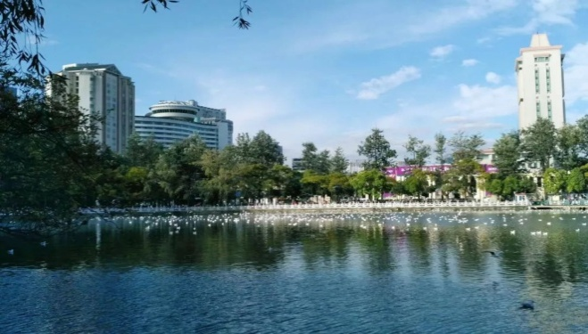
> 引用：Image 003 · image3.jpeg · 段落 13

> 段落 13 仅包含图片

午餐：翠湖公园附近

推荐美食：爱尚菌野生菌火锅翠湖店（有团购）、茴香熙楼(翠湖店)（有团购）、茴香云南盛·过桥米线厂牌(翠湖店)（有团购）

14:00—17:00陆军讲武堂—滇池（海埂公园，海埂大坝）（步行）

交通：乘坐观光1号线在民族文化村下车，滴滴打车至“海埂公园”约25元。

步行导航搜索“海埂大坝”，从海埂公园沿着滇池路一直走过去，这是一个看鸟的地方只是夏天可能没有。

注：民族文化村建议不去，就是个人造村子门票还贵，去滇池玩玩就行了。

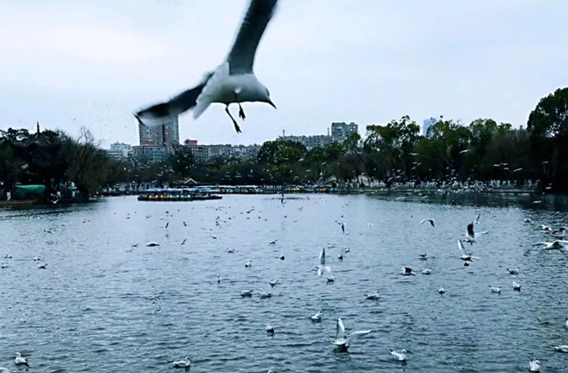
> 引用：Image 004 · image4.png · 段落 20

> 段落 20 仅包含图片

17:00—20:00海埂大坝—昆明老街，附近晚餐（公交）

交通：在海埂大坝乘坐观光1号线在艺术剧院站下车（末班车17:00），直接打车前往“正义路”约27元。

昆明老街是昆明的传统民俗街区，亦是本地人的资深食堂。

旅游路线：正义路→五一路（找不到路就用地图app搜起点和终点）

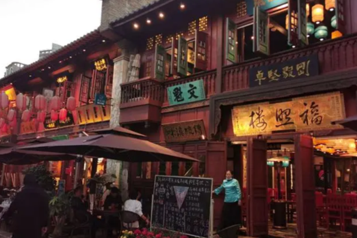
> 引用：Image 005 · image5.png · 段落 25

> 段落 25 仅包含图片

推荐餐馆：

1老滇山寨（人均80元，有团购）：烩野生杂菌、思茅甜笋、扒猪腿。昆明老字号餐馆，主打云南菜，装修高档。

2太阳饭店市府东街店（人均50元）：太阳小炒、铁板豆腐、滇味米线、汽锅鸡。本地苍蝇馆子，价格便宜，环境一般。

3菌故·野生菌火锅(南屏店)（人均110元，有团购）：野生菌火锅，如果担心被宰，请用团购。

游玩以后步行返回酒店。

当天住宿：昆明老街

推荐酒店：格林豪泰智选酒店(昆明南屏步行街金鹰购物广场店)（180+，标间）、汉庭酒店（昆明南屏步行街店）（250+单间）、如家商旅酒店(昆明南屏步行街宝善街店)（270+，标间）、昆明丽江万达美华别院（330+，标间）、旅宿.设计师民宿(南屏街店)(220+，可住6人)

Day2（3.31）：昆明老街—昆明站—大理站（租车）—大理港码头—下关街道午餐—理想邦圣托里尼—金梭岛码头—大理海东镇（宿）

9:00—10:00昆明老街—昆明站（打车）

交通：直接打车前往“昆明站”，约8元。

10:00—12:30昆明站—大理站，附近午餐（火车）

> 引用：Image 006 · image6.png · 段落 37

> 段落 37 仅包含图片

如果想要省钱，其实更加推荐这班火车，比其他班次便宜接近40元！

> 引用：Image 007 · image7.png · 段落 39

> 段落 39 仅包含图片

12:30—13:30云想山—大理港码头（自驾约20分钟）

导航搜索“大理港码头”。

大理港码头，沿着湖边走一走，对岸就是苍山洱海。这里可以看日落，拍到全景很壮阔。

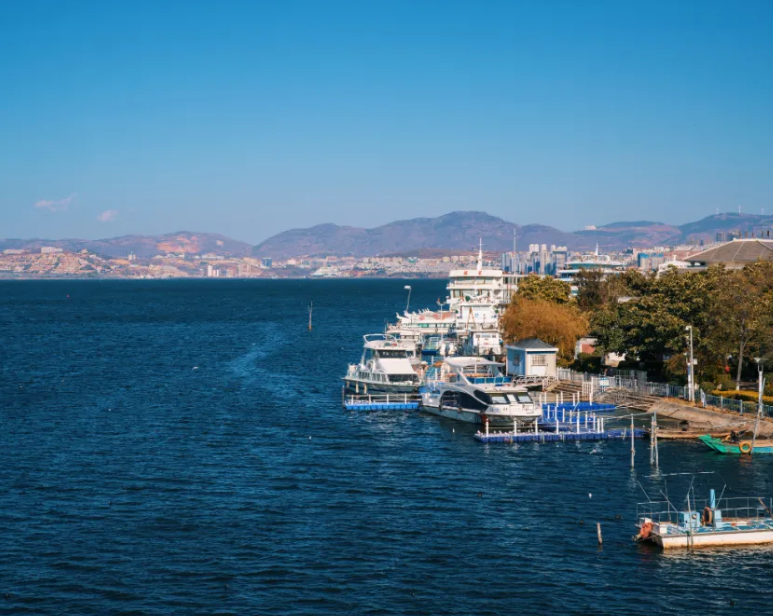
> 引用：Image 008 · image8.png · 段落 43

> 段落 43 仅包含图片

13:30—15:00大理港码头—大理下关街道，附近午餐（自驾约30分钟）

导航搜索“大理下关街道”，或直接导航餐馆。

下关是大理的老城区，本地人吃饭的地方，附近物价比较便宜。

推荐美食：

1滨海鱼庄云南菜野生菌火锅(大理港码头店)：大理码头的斜对面，一家野生菌餐厅。

2巅西味道铜瓢牛肉火锅(开发区店) （有团购）：非常火爆的铜瓢牛肉。

3老缅婆傣味餐厅(金牛巷店)（有团购）：想吃傣味不要错过。

4玉田鱼馆关平路店：鱼和豆腐是特色。

5建水兄弟鸡脚王(富海路店) （有团购）：这其实是一家烧烤店。

15:00—17:00大理下关街道—理想邦圣托里尼（自驾约20分钟）

导航搜索“理想邦”。

洱海边上的圣托里尼，里面可以免费进入。

但上到楼顶要喝茶消费，这个就看自己了，个人觉得走走免费的长廊即可。

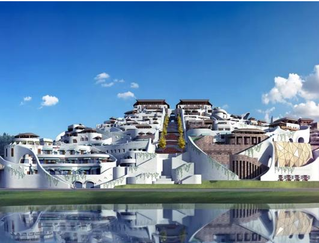
> 引用：Image 009 · image9.png · 段落 57

> 段落 57 仅包含图片

17:00—19:00大理海东镇—金梭岛码头（自驾约20分钟）

导航搜索“金梭岛码头”，旁边有个湿地公园，走到水边可以拍到枯树倒影。

> 引用：Image 010 · image10.png · 段落 60

> 段落 60 仅包含图片

游玩后返回酒店休息，天气好可以附近看个日落。

19:00—20:00金梭岛—大理海东镇，附近晚餐（自驾约10分钟）

直接导航餐馆。

晚餐：海东镇，本地人吃饭地，物价便宜东西好吃。

推荐美食：禄福驴肉馆、海之东农庄野生菌火锅、海东正宗石板烧烤（有团购）、祥瑞正宗巍山火巴肉饵丝(环海东路店)

当天住宿：大理海东镇

推荐酒店：美墅家·海边休闲度假别墅( 大理理想邦店)（700+，别墅）、昆弥川Quiesce·观霞看海静谧意境美宿(大理洱海店)（1000+，别墅）、大理海东方云宿海景民宿(大理机场店)（2000+，别墅）

Ps：可以在去哪儿网或携程找到打电话过去讲价，一般会更为便宜。（不要用平台内拨会录音）

Day3（4.1）：大理海东镇—文笔村—小普陀—挖色镇午餐—双廊古镇—喜洲古镇—大理古城南门（宿）

上午就在酒店附近游玩，然后自驾出发。

11:00—12:00大理海东镇—文笔村（自驾约30分钟）

导航搜索“文笔村”。

洱海边上的绝美小村庄，整个村子建在半山悬崖上，随手一拍都是大片。

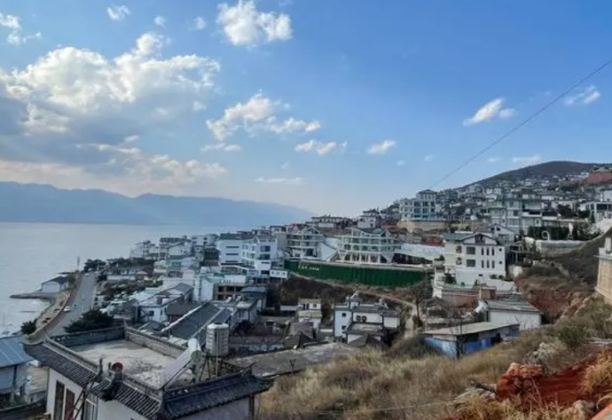
> 引用：Image 011 · image11.jpeg · 段落 74

> 段落 74 仅包含图片

11:00—12:00文笔村—小普陀（自驾约10分钟）

导航搜索“小普陀”。

小普陀因岛形和楼阁颇似神话里的南海普陀山，故而有了这个名字。

上岛大可不必，除非有烧香拜佛的心愿，远观一样很美。

> 引用：Image 012 · image12.jpeg · 段落 79

> 段落 79 仅包含图片

午餐：挖色镇附近

小普陀杨家饭店（人均40元，有团购）、小院木桶鱼小普陀店（人均60元，有团购）、渔家村饭店野生菌火锅小普陀店（人均70元，有团购）、渔民家常菜（人均60元，有团购）

14:00—16:00小普陀—双廊古镇（自驾约30分钟）

洱海边上的古镇，沿线很多咖啡馆。

这里最著名的景点是南诏风情岛，需要花费50元船票往返（美团可定）。

这里是仙剑一的拍摄地，如果没有兴趣上岛，就在岸边看看也可以了。

> 引用：Image 013 · image13.png · 段落 86

> 段落 86 仅包含图片

网红拍照地：

双廊古镇码头，连绵的花海配上湖景实在梦幻；南诏风情岛，仙剑一的取景地，赵灵儿的家乡。

特色店铺：

1杨丽萍太阳宫艺术空间（人均130元）：知名度就不用说了，网红打卡景点价格略贵，128元每人消费才能入内。

2半山半水海景下午茶餐厅(双廊洱海店)（人均40元）：全海景餐厅，可以在这来个下午茶。

3老奶奶烤乳扇（人均10元）：xhs上的网红，烤乳扇很有特色。

16:00—18:00双廊古镇—喜洲古镇（自驾约30分钟）

导航搜索“喜洲古镇”，喜洲粑粑和麦田很有名。

这里主要看的是田园风光，刘亦菲主演的电视剧就在此取景，没必要进入收费景区。

> 引用：Image 014 · image14.png · 段落 96

> 段落 96 仅包含图片

附近美食：

1四方街食府（人均80元）：白族庭院餐厅，大众点评唯一一家必吃榜餐厅。

2朋亦乐庭院牦牛火锅（人均80元）：罗非鱼和现做荞麦饼可以尝试。

3乡绅杨记喜洲破酥粑粑（人均10元）：喜洲特色小吃，吃完可以买几个带走。

特色项目——喜洲扎染：

喜洲最出名的就是扎染，如xhs最出名的蓝七扎染，可以带上裙子或购买裙子现场扎染。

18:00—20:00喜洲古镇—大理古城南门，附近晚餐（自驾约30分钟）

自驾前往酒店，把车子停在停车场里，然后再出来逛。

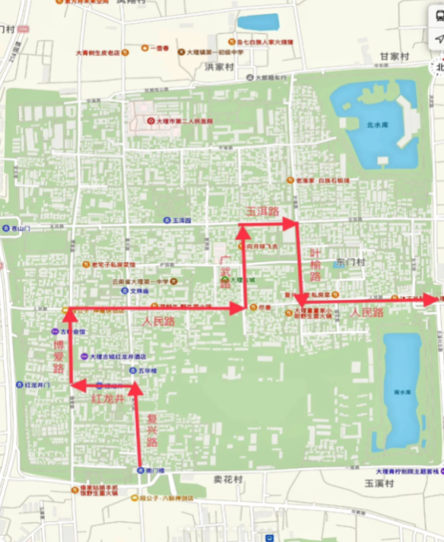
> 引用：Image 015 · image15.png · 段落 105

> 段落 105 仅包含图片

游玩路线：古城南门→复兴路→红龙井→博爱路→人民路→广武路→玉洱路→叶榆路→人民路→洱海门，共计约3.2公里。
建议停留游玩点：

篝火晚会：南门进入走200多米，杜文秀元帅府门口，每晚20：00-21：00都会举办篝火晚会，社牛可以加入一起跳舞。
五华楼：古城地标建筑，可免费登楼拍照、俯瞰古城夜景。（二楼开放时间9：30-23：00）
红龙井：全长约406米，沿路遍布叠水台、石拱桥，流水两旁绿树成荫，白天有小桥流水的静谧感，晚上沿途酒吧开始营业，非常热闹，被称为“水景酒吧一条街”。（晚上去的话逛图上标的前半段就行了，后面基本没什么店营业）
广武路：全长约650米，聚集了“向月球飞去”、“大青树咖啡”、“弯弯古着店”等文艺、有趣、年轻的网红店。夜市摊除了其他街巷常见的占卜、饰品、纹身等，还有一些原创手作小摊出没。
洱海门夜宵街：和白天的洱海门截然不同，从通往城门的人民路开始，全是小吃摊，有云南的傣味、景颇味、烧烤…还有一些寻常的景点小吃，吃饱喝足返程刚刚好。

推荐正餐：

1振华饭店（人民路店）（人均60元）：开了很多年的老店，典型的炒菜饭店，不像游客店那么坑人。（节假日必须打电话预约，网上还有多人团购餐）

2金兵清香园（人均60元）：古城最有性价比的清真餐厅，主要以牛羊肉为主，本地人多光顾。

3音秋香野生菌火锅(2分店)（人均100元）：野生菌火锅，但现在不是产菌的季节。

4段公子天龙八部店（人均100元）：网红店晚上有驻唱，味道中规中矩，主要感受热闹氛围。

5亦乐饭店（人均100元）：追求仪式感，可以订这家餐厅。

买水果：

四方街超市里面都是明码实价，可以去买点水果，价格相对比较实惠，还经常有活动。

当天住宿：大理古城南门

推荐酒店：DaLi泊途·苍洱毓秀轻奢美宿(大理古城南门店)（700+，独栋）、朴谷子越野跑度假别墅(福安巷分店)（1000+，独栋）、旺先生庭院·花园·美宿(大理古城洱海门店)（1300+，独栋）、大理竹隐山房（1700+，独栋）

Ps：如果不想换酒店，可以宿前一晚海东镇酒店，第二天不去海西生态长廊，直接到沙溪古镇即可。

Day4（4.2）：大理古城南门—海西生态长廊（才村、下波棚、廊桥）—大理沙溪古镇（宿）

9:00—10:00大理古城—才村（自驾约10分钟）

导航搜索“才村完小”，附近马路边可以停。但如果担心贴罚单，旁边也有停车场。

（收费停车场5元每小时，超出1元每小时，当然这个停车场算便宜的）。

才村是洱海西岸最著名的村落，如今已经建成生态长廊，可以一路边走边拍。

> 引用：Image 016 · image16.jpeg · 段落 124

> 段落 124 仅包含图片

拍照点：造型独特的枯树、枯萎的芦苇荡

午餐：才村附近

1餐海•海景餐厅•特色云南菜•野生菌火锅：海景餐厅，还有一个可供拍照的扶梯，几公里外免费接送。

2风鹤轩：私房菜，是院子不是海景，有很多本地人光顾。

10:00—10:30才村—下波棚（自驾约10分钟）

导航搜索“下波棚”。

下波棚是海西一个非常有名的村落，处于S弯上，但不一定能拍到。

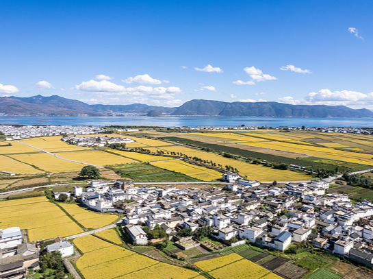
> 引用：Image 017 · image17.png · 段落 132

> 段落 132 仅包含图片

拍照点：网红S弯

10:30—11:00下波棚—廊桥（自驾约10分钟）

导航搜索“廊桥”。

廊桥最著名的就是歪鼻子树，已经成为美女们人手一张照片的拍摄地。

> 引用：Image 018 · image18.png · 段落 137

> 段落 137 仅包含图片

拍照点：古风廊桥、枯树摆拍

11:00—20:00廊桥—沙溪古镇（自驾约1.5小时）

导航搜索“沙溪古镇”，在大理城郊。刘亦菲《有风的地方》取景地，沙溪因此而爆火。

推荐美食：

百味轩私房菜（人均70元）、带皮毛驴肉牛肉火锅店(原天运饭店)（人均80元）、丽花清真牛肉馆（人均30元）、龙凤瑞英清真饭馆（人均60元）

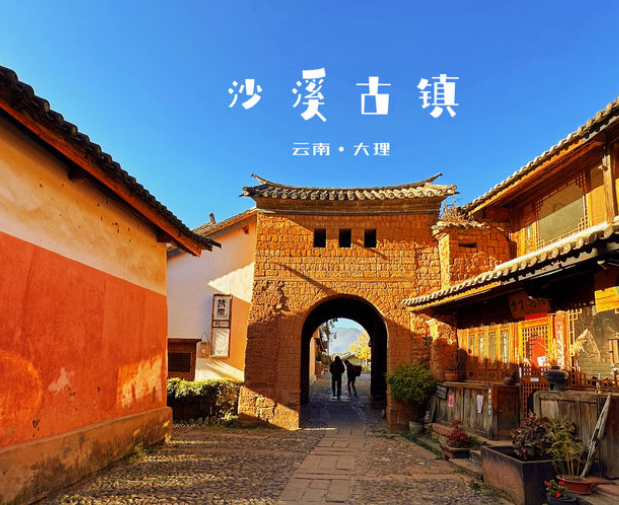
> 引用：Image 019 · image19.png · 段落 143

> 段落 143 仅包含图片

游玩路线：古镇不大，走路很轻松。

其它：

1沙溪真正好玩的是古镇外的玉津桥，看看牛羊，挤挤羊奶，听着乘着落日归来的马队的铃声，还有傍晚在玉津桥边唱歌的歌手。沙溪的美其实全部在于她的氛围感。

2在古镇的对面，有家李现同款先锋书店，穿行过成片的稻田，半小时就能到了。

午晚餐：沙溪古镇

推荐美食：

1白味轩私房菜（人均70元）：沙溪古镇很火的白族菜，需要提前预订。

2带皮毛驴肉牛肉火锅店(原天运饭店)（人均80元）：菜市场的一家火锅店，规模有点小，人多要分成几桌。

3龙凤瑞英清真饭馆（人均50元）：很好吃的清真馆子，牛羊肉很丰富。

当天住宿：大理沙溪古镇

推荐酒店：沙溪望山小筑民宿（1300+）、里巷·Tranquil Haven·轻奢美宿(沙溪古镇店)（2300+）

Day5（4.3）：大理沙溪古镇—泸沽湖大落水村—泸沽湖环湖游（云海情人滩→里格半岛→鸟岛）—泸沽湖风景区（宿）

9:00—15:00大理沙溪古镇—大落水村，附近午餐（自驾约4.5小时）

导航搜索“大落水村”，可以选择走丽宁公路，稍微省点钱。

这里是泸沽湖景区最热闹的地方，可以在附近吃个午餐。

推荐餐馆：阿妈野生菌土鸡腊排骨·蒸汽石锅鱼、摩挲菌香腊排骨石锅鱼、菌香小院蒸汽石锅鱼。

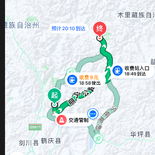
> 引用：Image 020 · image20.png · 段落 160

> 段落 160 仅包含图片

15:00—20:00泸沽湖环湖游（云海情人滩→里格半岛→鸟岛）
自驾，挨个导航名字即可

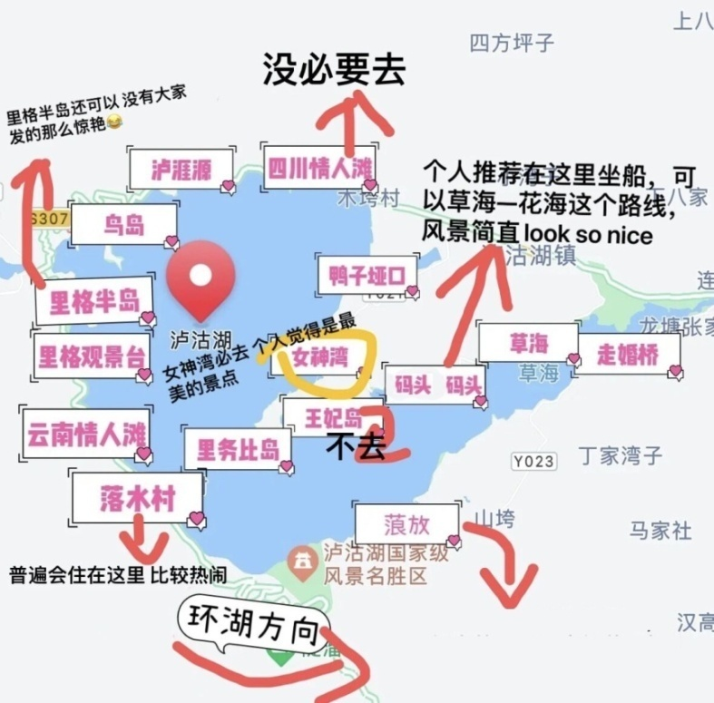
> 引用：Image 021 · image21.jpeg · 段落 162

> 段落 162 仅包含图片

a云南情人滩

这里是云南的情人滩，与四川的情人滩隔湖相望。景点有点单调，简单看下就行。

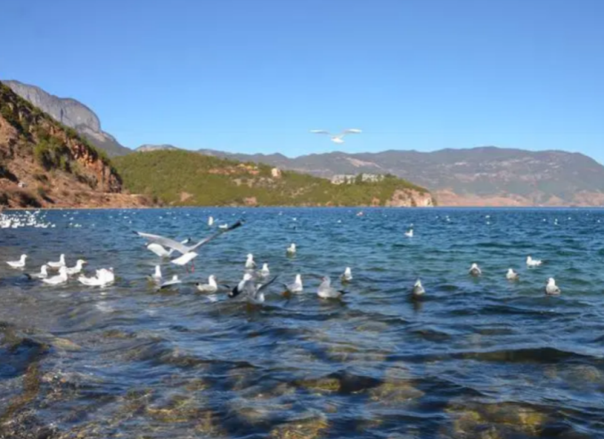
> 引用：Image 022 · image22.png · 段落 165

> 段落 165 仅包含图片

b里格半岛（重要景区）

泸沽湖最出名的景点之一，坐落于格姆女神山下。

可以从观景台下到湖边，走上里格半岛转一圈，这里的湖水是碧绿的。

自驾可以直接登上观景台，只是山上风有点大。

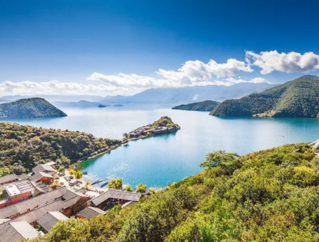
> 引用：Image 023 · image23.png · 段落 170

> 段落 170 仅包含图片

C 鸟岛

鸟岛是泸沽湖候鸟到访时的栖息之地，岛十分袖珍，远看去轮廓十分美妙可爱。

简单看眼就能走了，意愿不强也可以舍弃。

冬天就是看动物的时候，反正要路过又近，看自己去不去。

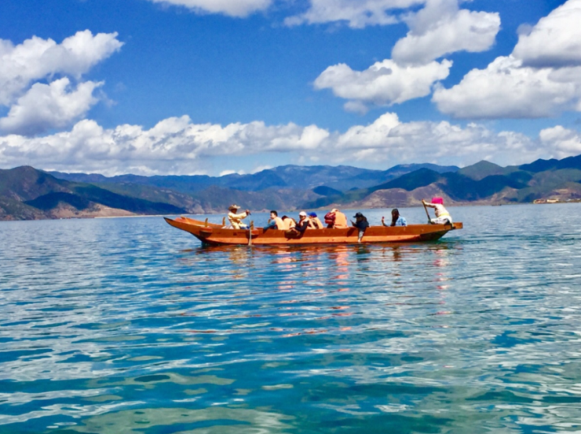
> 引用：Image 024 · image24.png · 段落 175

> 段落 175 仅包含图片

20:00—21:00鸟岛附近晚餐

推荐美食：泸沽湖鱼味餐厅（有团购）、泸沽湖野生菌蒸汽石锅鱼、聚香源柴火鸡（有团购）

泸沽湖篝火晚会去不去看自己，人工痕迹太严重，不如订个湖景房躺平。如果一定要去，请在闲鱼上买票，会省下不少银子。（篝火晚会就在大落水村，酒店附近）

当天住宿：泸沽湖风景区（连住两晚）

推荐酒店：泸沽湖银湖岛大酒店（200+，标间）、泸沽湖清尘尊品酒店（600+，可住4人）、泸沽湖咕噜家湖景智能度假民宿（900+，独栋）

Day6（4.4）：泸沽湖环湖游（泸源崖→女神湾→五支洛码头→草海→走婚桥—蒗放）—泸沽湖风景区（宿）

泸沽湖看晨雾：

泸沽湖四面八方都是码头：

如果住在鸟岛附近，最近的点是达祖码头和五支洛码头，可以找当地人或客栈老板直接包船；

如果住在大落水村，最近的是大洛水码头；因为这个地方是公共交通下车点，所以配套设施最齐全，相对来说也人最多最商业化。

包船价格：

150—200元左右，可以现场讲价。电商平台有售，也可咨询客栈老板。

10:00—19:00泸沽湖环湖游（泸源崖→女神湾→五支洛码头→草海→走婚桥—蒗放）

自驾，挨个导航名字即可

a泸源崖（重要景区）

泸源崖是泸沽湖的源头，也是泸沽湖湖水较深的地方，较深处可达90余米。此处石崖如削,景观独特。

> 引用：Image 025 · image25.png · 段落 192

> 段落 192 仅包含图片

b女神湾（重要景区）

女神湾是泸沽湖中一个安静的港湾，也是泸沽湖最美的湖湾之一，被游人称为东方夏威夷。

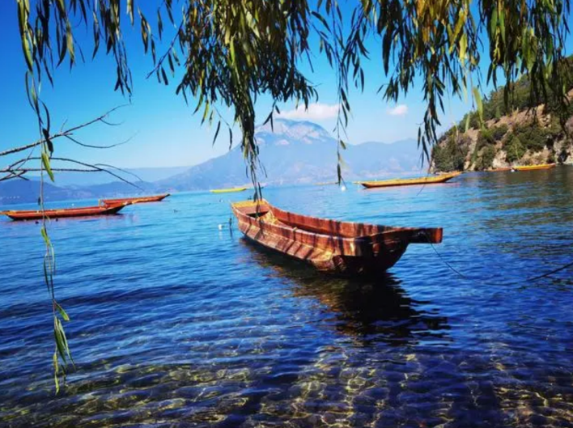
> 引用：Image 026 · image26.png · 段落 195

> 段落 195 仅包含图片

c五支洛码头（猪槽船）

不想坐船可以忽略，洛洼码头可坐猪槽船，游客较少性价比高。

猪槽船可以单买票也可以包船，记得讲价（对半砍）。

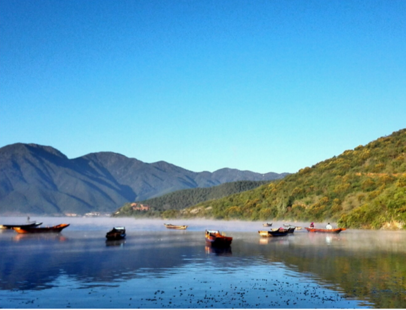
> 引用：Image 027 · image27.png · 段落 199

> 段落 199 仅包含图片

这个季节草是黄的、花没有开，所以选择选路1或4较为合适，只能看海鸥。

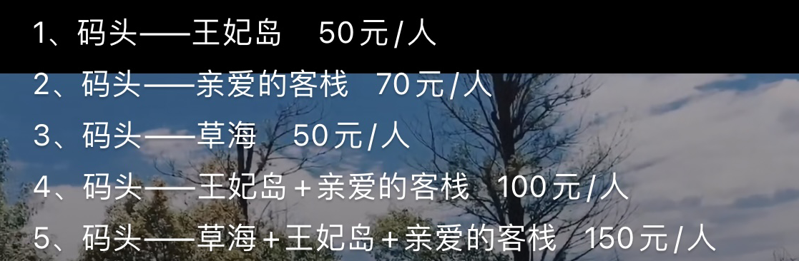
> 引用：Image 028 · image28.png · 段落 201

> 段落 201 仅包含图片

d草海（重要景区）

草海素有“鸟的王国”之称，共有鸟类100余种、珍稀鸟类70余种，是泸沽湖观鸟的最佳选择地。

草海附近还有个摩挲博物馆，如果有兴趣可以去看看，增长下见识。

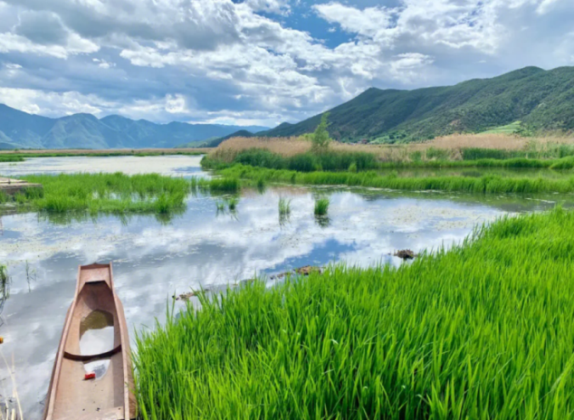
> 引用：Image 029 · image29.png · 段落 205

> 段落 205 仅包含图片

午餐推荐：香村土菜馆（人均40元），就在草海附近。

e走婚桥（重要景区）

走婚桥是摩梭男女约会的地方。泸沽湖畔的摩梭人奉行“男不娶，女不嫁”的“走婚”习俗，走婚桥横跨草海，连接两岸村庄，为男女提供了约会的通道。

传说，在这里和心爱的人手牵手走过，就可以拥有长久的爱情。

> 引用：Image 030 · image30.png · 段落 210

> 段落 210 仅包含图片

f蒗放

蒗放是泸沽湖最后开发的村子, 最大程度的保留了泸沽湖原有的风景和原生态。

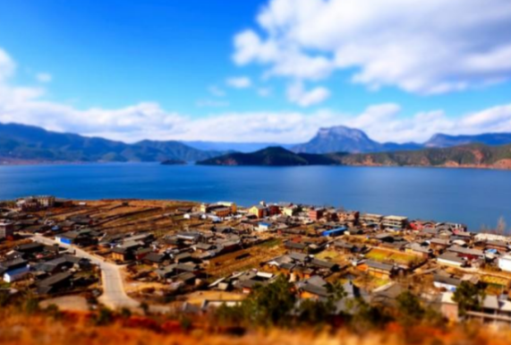
> 引用：Image 031 · image31.png · 段落 213

> 段落 213 仅包含图片

当天住宿：泸沽湖风景区（宿前一晚酒店）

Day7（4.5）：泸沽湖风景区—香格里拉午餐—纳帕海—独克宗古城（宿）

注：当天从泸沽湖归来，另一波人直接自驾去丽江即可。

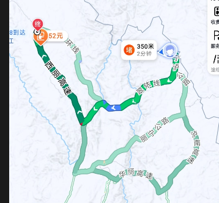
> 引用：Image 032 · image32.png · 段落 217

> 段落 217 仅包含图片

9:00—16:00沽湖风景区—香格里拉，附近午餐（自驾约5小时）

泸沽湖到香格里拉走哪条路？

1翠依线（最上面），路窄不好走，还有炮弹坑，回头弯很多。但一直环绕玉龙雪山，风景较好。（天气好不建议走，沿途风景也看不到）

2泸南高速（最下面），舒适性高，适合新手司机。路程最短，开得丝滑，高速上也有一些风景。

3丽宁公路（中间），省钱首选。相当好走，还能省下高速费。

导航搜索“香格里拉”，去之后吃个饭。

推荐美食：五彩雪域藏餐馆（有团购）、一品羊酒楼（有团购）、线太爷餐饮铺牦牛肉火锅（有团购）

16:00—19:00香格里拉市—纳帕海草原（自驾约20分钟）

导航搜索“哈木古村”。

走环湖路不仅可以深入其中，更重要的是可以免门票，完全不用进收费景区！

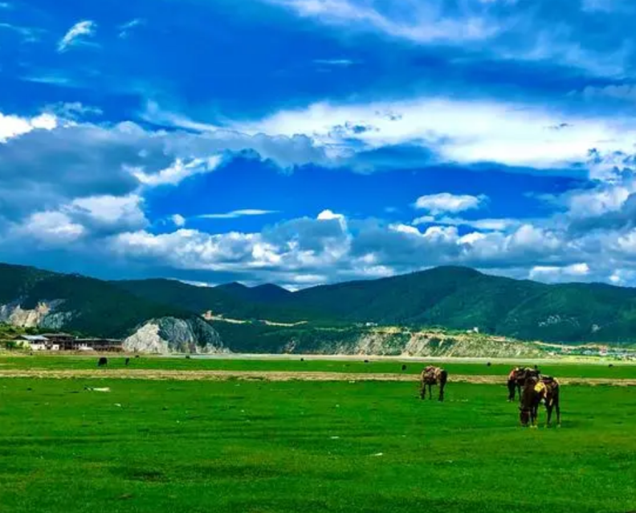
> 引用：Image 033 · image33.png · 段落 228

> 段落 228 仅包含图片

19:00—21:00纳帕海草原—独克宗古城，附近晚餐（自驾约20分钟）

自驾前往独克宗古城酒店入住。

附近美食：舌尖上的小厨师总店（有团购，人均70元，火锅），青木厨坊（有团购，人均50元，炒菜烤肉），塔洛藏餐吧（有团购，人均70元）、顺顺小吃（有团购，人均80元）

当天住宿：独克宗古城（连住两晚）

推荐酒店：梵璞山居·供氧观景巨幕投影私藏酒店(香格里拉独克宗古城店) （180+）、|锦鸢私汤·富氧智慧酒店(香格里拉独克宗古城店)（240+）、莲臣酒店(香格里拉独克宗古城店)（350+）

Day8（4.6）：独克宗古城—普达措森林公园—香格里拉市午餐—松赞林寺—独克宗古城（宿）

注：如果体力好，可以考虑把普达措换成无底湖，都是类似的景区但不要门票。不过无底湖离香格里拉城区往返4h，中途还要徒步3h约4km，看自己能不能接受。

9:00—15:00独克宗古城—普达措森林公园（自驾约30分钟）

导航搜索“普达措森林公园”，门票138元。（美团可定）

Ps：普达措，香格里拉唯一的5A景区。这个景点以轻徒步为主，全程5—6小时。

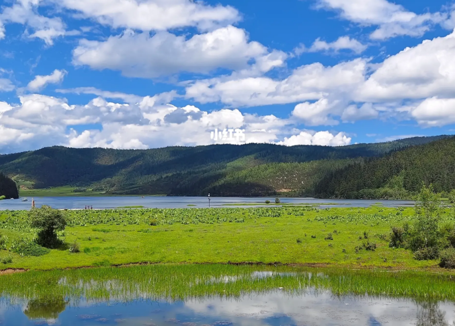
> 引用：Image 034 · image34.png · 段落 239

> 段落 239 仅包含图片

游览路线：

有三段徒步路线，各段路线间需乘坐观光车接驳，全玩下来怎么也要五六个小时吧。

①洛茸村生态徒步路线（2.2km）
这段路比较原生态，土路+石子路，溯溪而上，终点是个瀑布。观光车上的导游话里话外不推荐去，但我觉得还可以，主要是人会相对少一点，有一段爬升，但很短。

②属都湖栈道（3.5km）
这段路全程平缓栈道，人最多，不过风景很美很开阔。属都湖可坐船，船票50（需补钱）。

③碧塔湖栈道（1km）
要坐观光车回到大门换车到达。碧塔湖视野不如属都湖开阔，但有种秘境之感，且可以看到满是野花的草原和马儿。五六月份有“杜鹃醉鱼”和“老熊捞鱼”两大奇景，现在能否得见要看运气了。

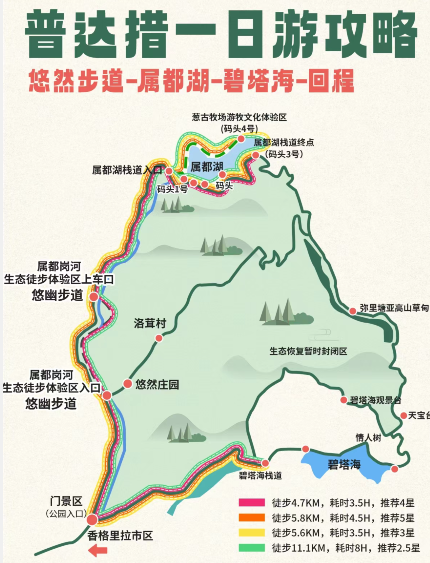
> 引用：Image 035 · image35.png · 段落 245

> 段落 245 仅包含图片

15:00—16:30普达措森林公园—香格里拉市区午餐（自驾约30分钟）

导航搜索“香格里拉市”。

推荐美食：五彩雪域藏餐馆（有团购）、一品羊酒楼（有团购）、线太爷餐饮铺牦牛肉火锅（有团购）

16:30—18:00香格里拉市区—松赞林寺（自驾约20分钟）

导航搜索“松赞林寺”。

松赞林寺是云南省规模最大的藏传佛教寺院，也是康区有名的大寺院之一，被誉为“小布达拉宫”。

> 引用：Image 036 · image36.png · 段落 252

> 段落 252 仅包含图片

Tips：这个景点门票+观光车=65元（必须携带身份证）。

如果对寺庙没兴趣，可以当天早点回独克宗古城游玩。

18:00—21:00松赞林寺—独克宗古城（自驾约20分钟）

导航搜索“独克宗古城”。

当天就在独克宗古城游玩，后面就是龟山公园，拥有实际上最大的传经筒。

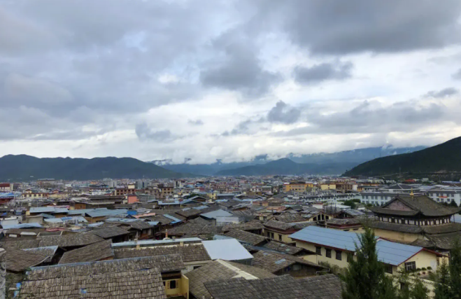
> 引用：Image 037 · image37.png · 段落 258

> 段落 258 仅包含图片

附近美食：舌尖上的小厨师总店（有团购，人均70元，火锅），青木厨坊（有团购，人均50元，炒菜烤肉），塔洛藏餐吧（有团购，人均70元）、顺顺小吃（有团购，人均80元）

> 引用：Image 038 · image38.png · 段落 260

> 段落 260 仅包含图片

游玩地图：

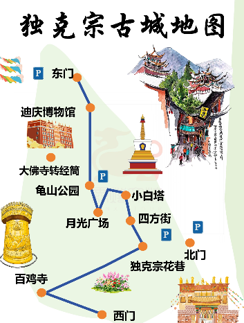
> 引用：Image 039 · image39.png · 段落 262

> 段落 262 仅包含图片

注：如果想凹造型出片，可以导航“大金幡”，就在独克宗边缘。但也要收门票，非常不值。

当天住宿：独克宗古城（宿前一晚酒店）

Day9（4.7）：独克宗古城—瓦卡镇午餐—金沙江大拐弯—白马雪山观景台—白马雪山垭口—雾浓顶一棵树—梅里雪山飞来寺（宿）

10:00—13:00独克宗古城—瓦卡镇，附近午餐（自驾约1.5小时）

导航搜索“瓦卡镇”，错过就很久有饭吃了。

附近美食：老刘白族饭店、川滇宾旺家庄、四川妹子饭店、嘟嘟冒菜

13:00—13:30瓦卡镇—金沙江大拐弯（自驾约10分钟）

导航搜索“金沙江大拐弯”。

别称月亮湾，也称金沙江大湾、金沙江大拐弯 。

> 引用：Image 040 · image40.png · 段落 272

> 段落 272 仅包含图片

13:30—15:00金沙江大拐弯—白马雪山观景台（自驾约1小时）

导航搜索“白马雪山观景台”，可以远观白马雪山。

15:00—16:00白马雪山观景台—白马雪山垭口（自驾约40分钟）

导航搜索“白马雪山垭口”，感受神山的至高点。

16:00—18:00白马雪山垭口—梅里雪山雾浓顶（自驾约50分钟）

导航搜索“雾浓顶”，这里是观赏梅里雪山的绝佳位置。

小众人少，视野开阔，拍照不用抢机位。

> 引用：Image 041 · image41.png · 段落 280

> 段落 280 仅包含图片

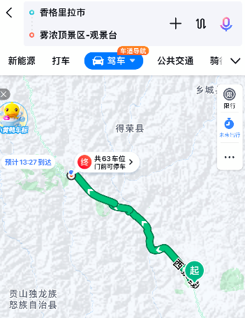
> 引用：Image 042 · image42.png · 段落 281

> 段落 281 仅包含图片

18:00—20:00梅里雪山雾浓顶—梅里雪山飞来寺，附近晚餐（自驾约30分钟）

导航搜索“飞来寺”，传说现在免费了，头一天没看到第二天早上可以继续。

如果还是要收费往下走200米，看到的景色一模一样，总之完全没必要花钱。

可以关注下当地日落时间（约19:00），运气好能看到日落金山。

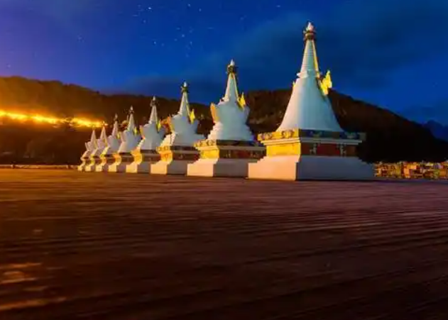
> 引用：Image 043 · image43.png · 段落 286

> 段落 286 仅包含图片

关于晚餐；飞来寺附近吃饭巨坑，建议简餐不要迷信网红店，如果一定要吃大餐最好用团购。

推荐美食：老字号特色火锅店（有团购）、味绝特色藏餐梅里店（有团购）、谷里嘉红火塘（有团购）

当天住宿：梅里雪山飞来寺

推荐酒店：明珠拉卡雪山观景酒店(飞来寺梅里雪山景区店)（250+）、德钦神峰聚缘观景酒店（280+）、映雪山舍（500+）

Day10（4.8）：梅里雪山飞来寺—香格里拉市午餐—虎跳峡—丽江古城北门（宿）

9:00—13:30梅里雪山飞来寺—香格里拉市，附近午餐（自驾约3小时）

导航搜索“香格里拉市”，城区吃饭便宜实惠。

推荐美食：五彩雪域藏餐馆（有团购）、一品羊酒楼（有团购）、线太爷餐饮铺牦牛肉火锅（有团购）

13:30—17:00香格里拉市—虎跳峡（自驾约1.5小时）

导航搜索“虎跳峡”。

至于去不去虎跳峡收费景区就看自己了，可以下去看到那个大拐弯。门票45元，18:00停止入场。

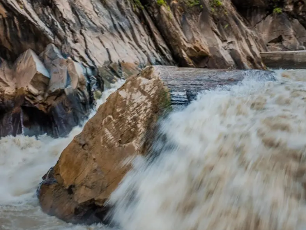
> 引用：Image 044 · image44.png · 段落 298

> 段落 298 仅包含图片

虎跳峡景区避坑攻略：

下去单程10分钟就到了，如果想省钱，完全没必要补80元/人的扶梯票。

注意事项：

如果只是光想看看虎跳峡而不是拐弯，可以不必买票进入景区，白水台途径之路上也能看到虎跳峡。

17:00—20:00虎跳峡—丽江城区晚餐（自驾约1.5小时）

丽江古城消费贵，味道一般。如果时间充足，可考虑去老城区巷子里吃。

推荐美食：云南鲜野生菌火锅•生态罗非鱼(七星街上段店)（人均50元，馆子虽小食材新鲜）、三川火腿乌骨鸡（人均60元，本地人的苍蝇馆子）、金川火塘(雪山店)（人均70元，环境还行当地特色）

吃完饭以后自驾前往酒店。

当天住宿：丽江古城北门（连住两晚）

推荐酒店：禾下·梵尘莲花｜Harvest Grace沐沁纳西合院美宿(丽江古城店)（650+）、映雪｜MAYDAY古城观景客栈(丽江古城四方街店)（800+）、漫语·听风Firstsight观景美宿(丽江古城大水车店)（1000+）

Day11（4.9）：丽江古城北门—玉龙雪山（冰川公园+蓝月谷或云杉坪+蓝月谷）—丽江古城北门（宿）

提前七天可订牦牛坪、云杉坪、冰川公园门票：

关注“丽江旅游集团”，提前7天20:00放票，旺季必须提前预订。（冰川公园、牦牛坪、云杉坪）

19:55进入购票页面按步骤操作，等到19:58把手指按到拼图上验证好，切记不要松开手指，看时间变成20:00松开手指。（冰川公园必须准点抢票）

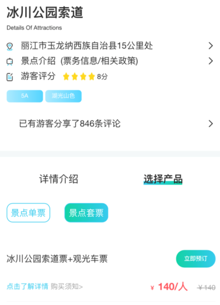
> 引用：Image 045 · image45.png · 段落 313

> 段落 313 仅包含图片

8:00—14:00丽江古城—玉龙雪山风景区（冰川公园+蓝月谷或云杉坪+蓝月谷）（自驾约40分钟）

导航搜索“玉龙雪山景区游客服务中心(雪川游客港)”。（预约9:00左右）

玉龙雪山主要包括四大景点：

冰川公园、云杉坪、牦牛坪、蓝月谷。一天之内想走完这几个景点不可能，建议选2—3个就行了。

个人看法：如果想爬雪山，选冰川公园+蓝月谷；如果担心高反，选云杉坪+蓝月谷。

牦牛坪和云杉坪风景颇为类似，没必要都去；

冰川公园就是爬雪山，相对容易高反较累。

蓝月谷反正不要钱，不去不去白不去。

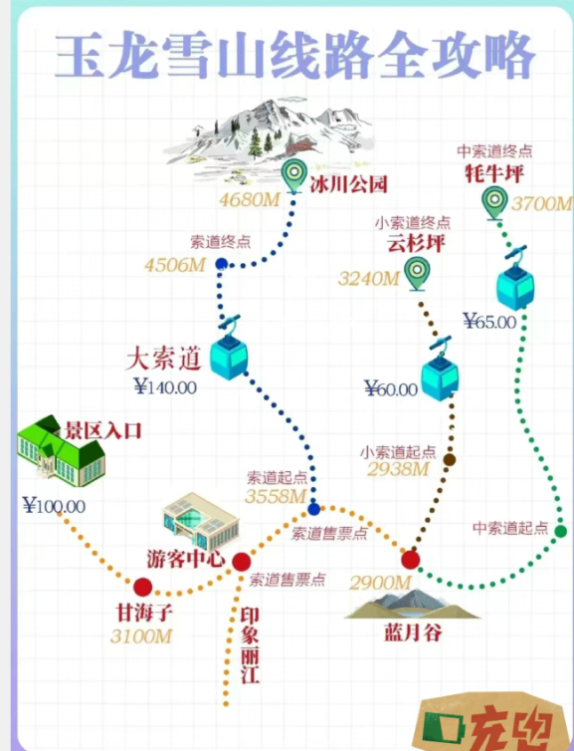
> 引用：Image 046 · image46.png · 段落 322

> 段落 322 仅包含图片

如何买票？

关注“丽江旅游集团”，即可提前买票。

云杉坪、牦牛坪、冰川公园都可在公众号上买票，但只有冰川公园需要抢票。

关于门票：

进山费100元/人（强制买），冰川公园140元/人，牦牛坪65元/人，云杉坪60元/人，蓝月谷免费（最后50元/人观光车可不买，很快就走出去了）。

其他注意事项：

如果之前没去过高海拔地区，最好在古城买个氧气瓶。

另外玉龙雪山基本只有游客中心附近有餐厅，当天建议自带路餐不是随时随地能吃。

推荐：游客中心雪厨餐厅，一楼是小火锅，二楼是自助餐。

最后强调！蓝月谷50元/人观光车完全没必要买，走一点路很快出去了！

14:00—16:00玉龙雪山风景区—丽江白沙镇，附近午餐（自驾约20分钟）

导航搜索“丽江白沙镇”。

白沙镇，远观玉龙雪山的最佳地点，也是丽江唯一没有商业化的古镇。

> 引用：Image 047 · image47.png · 段落 336

> 段落 336 仅包含图片

附近美食：云雪丽白沙火塘（网红店，观景餐厅，有团购）、白沙人家餐厅（人均70元，纳西菜）、陈大厨白沙风味馆（人均70元，特色炒菜）

16:00—19:00白沙古镇—丽江古城北门（自驾约40分钟）

直接导航酒店，把车停在停车场，然后再出来逛。

丽江大研古城是世界文化遗产。不过现在商业化严重，从街头到巷尾都销售着义乌小商品，里面东西偏贵。

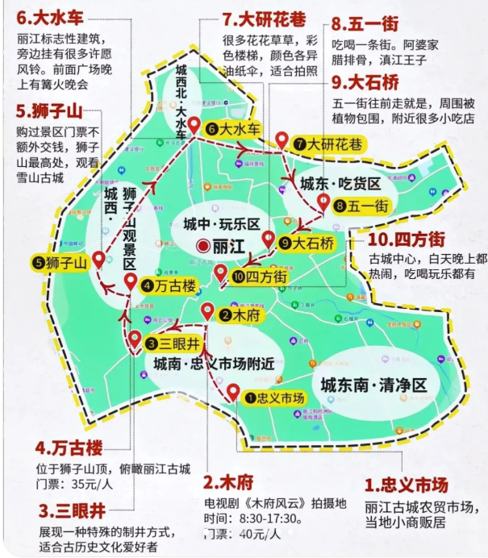
> 引用：Image 048 · image48.png · 段落 341

> 段落 341 仅包含图片

游玩路线：

北门大水车—丽江之眼观景台— 大研花巷—新华街（酒吧街）—四方街（古城中心）— 现文巷（油纸伞）—狮子山—大石桥（樱花餐厅）— 振兴街（灯笼巷）—七一街（木府、忠义市场）—回酒店

晚餐：丽江古城北门附近

附近美食：云雪丽民族风情纳西庭院餐厅（人均100,元，有团购）、阿婆情腊排骨火锅（人均60元，有团购）、遇见马帮菜丽江味道主题餐饮（人均80元，有团购）、屋顶咖啡院落茶饮（人均50元，有团购）

当天住宿：丽江古城北门（宿前一晚酒店）

行程汇总：

Day1（3.30）：昆明老街—云南大学、翠湖公园、陆军讲武堂—滇池（海埂公园，海埂大坝）—昆明老街（宿）

Day2（3.31）：昆明老街—昆明站—大理站（租车）—大理港码头—下关街道午餐—理想邦圣托里尼—金梭岛码头—大理海东镇（宿）

Day3（4.1）：大理海东镇—文笔村—小普陀—挖色镇午餐—双廊古镇—喜洲古镇—大理古城南门（宿）

Day4（4.2）：大理古城南门—海西生态长廊（才村、下波棚、廊桥）—大理沙溪古镇（宿）

Day5（4.3）：大理沙溪古镇—泸沽湖大落水村—泸沽湖环湖游（云海情人滩→里格半岛→鸟岛）—泸沽湖风景区（宿）

Day6（4.4）：泸沽湖环湖游（泸源崖→女神湾→五支洛码头→草海→走婚桥—蒗放）—泸沽湖风景区（宿）

Day7（4.5）：泸沽湖风景区—香格里拉午餐—纳帕海—独克宗古城（宿）

Day8（4.6）：独克宗古城—普达措森林公园—香格里拉市午餐—松赞林寺—独克宗古城（宿）

Day9（4.7）：独克宗古城—瓦卡镇午餐—金沙江大拐弯—白马雪山观景台—白马雪山垭口—雾浓顶一棵树—梅里雪山飞来寺（宿）

Day10（4.8）：梅里雪山飞来寺—香格里拉市午餐—虎跳峡—丽江古城北门（宿）

Day11（4.9）：丽江古城北门—玉龙雪山（冰川公园+蓝月谷或云杉坪+蓝月谷）—丽江古城北门（宿）

注意事项：

1云南穿什么？早晚温差大，下雨也挺冷。昆明大理丽江要穿夏装，香格里拉要穿针织衫，上雪山最好带个羽绒服。

2准备好晕车药和感冒药，以防万一。

3注意防晒，云南紫外线很强，墨镜面罩防晒霜帽子必备。

4如果遇到欺诈，下载“游云南”app，30天无理由退货。

5云南吃饭上美团选套餐，住宿上去哪儿网，这是当地特色一般便宜点。

6需提前预订门票：玉龙雪山（云杉坪、牦牛坪、冰川公园 无论哪个，最好都守点抢票）。

7需提前预订车票：昆明站—大理站。

玉龙雪山订票必须重视！如果要去冰川公园提前7天抢票！（云杉坪、牦牛坪直接购买即可，也要提前买）

关注“丽江旅游集团”，把所有出行人的信息添加好。

早上19:55进入购票页面按步骤操作，等到19:58把手指按到拼图上验证好，切记不要松开手指，看时间变成20:00松开手指。

冰川公园、云杉坪、牦牛坪如果都要，需要分开订票。

需携带物品梳理：

1内裤，袜子，睡衣，鞋，背包，墨镜（镜片or隐形+墨镜）、随身衣服

2刮胡刀，擦镜布，唇膏，护肤，防晒霜

3鼻炎喷雾，消炎药，感冒药，胃药，薄荷糖

4充电宝，充电器，耳机

5卡包（银行卡+身份证）
